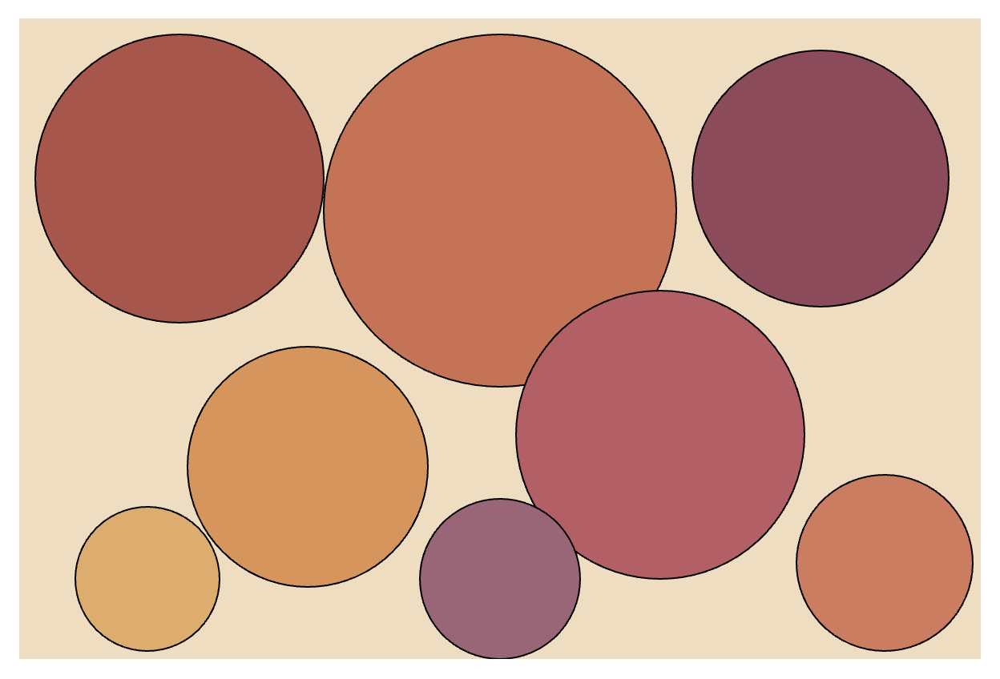
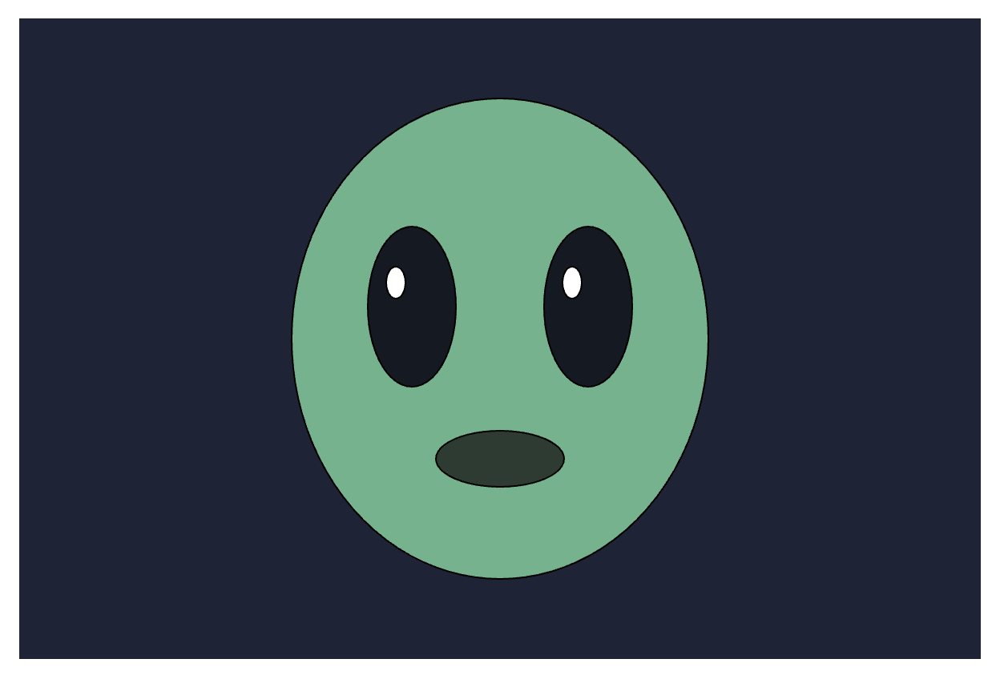

# CART 253 — Creative Computation 1

This website documents my work for CART 253: Creative Computation 1. It collects my prototypes and experiments as I learn JavaScript, p5.js, and creative coding throughout the semester.

## Useful Links

- [Reflective Journal](./journal.md)

## Prototypes

This section will contain my creative coding prototypes and projects throughout the semester.

### First prototypes under project 1!

#### Proto 1 - Sunset

Live Link: http://127.0.0.1:5500/prototyping%20instructions%20new/proto-1-sunset/

#### Proto 2 - Abstract Circles

Live Link: http://127.0.0.1:5500/prototyping%20instructions%20new/proto-2-abstract%20circles/

#### Proto 3 - Alien

Live Link: http://127.0.0.1:5500/prototyping%20instructions%20new/proto-3-alien/
