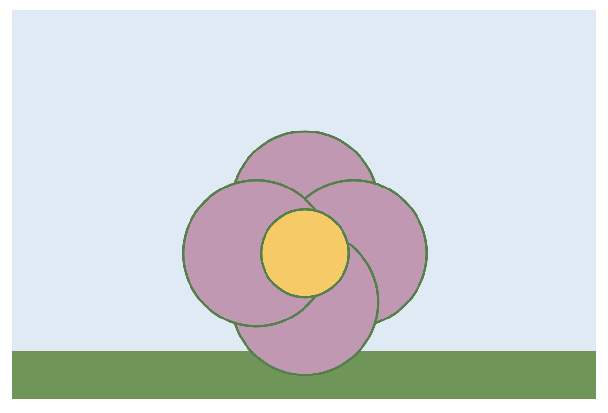
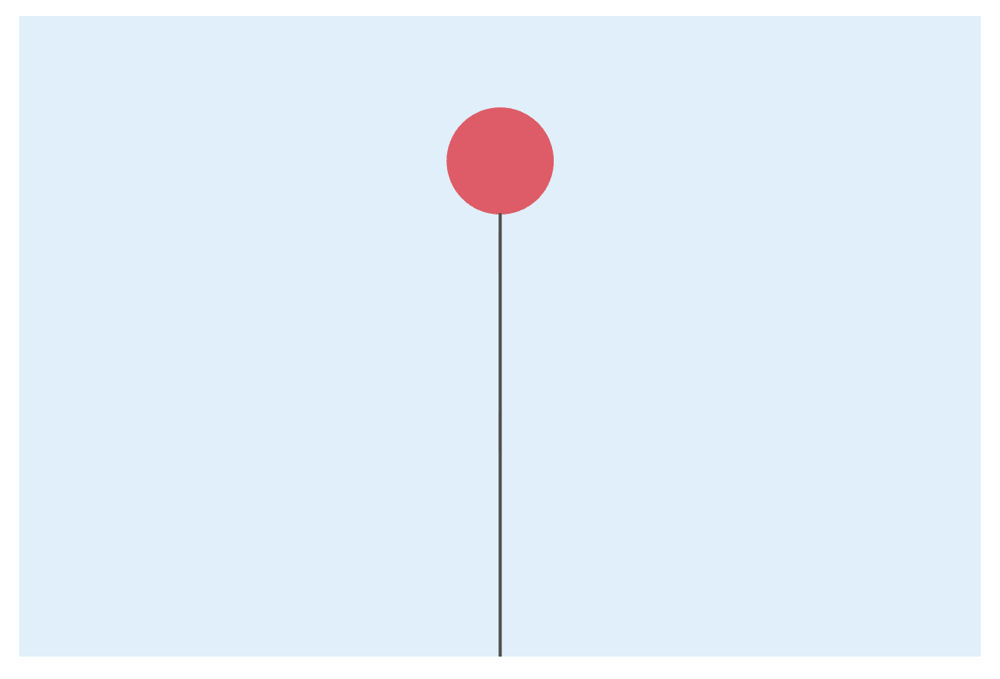
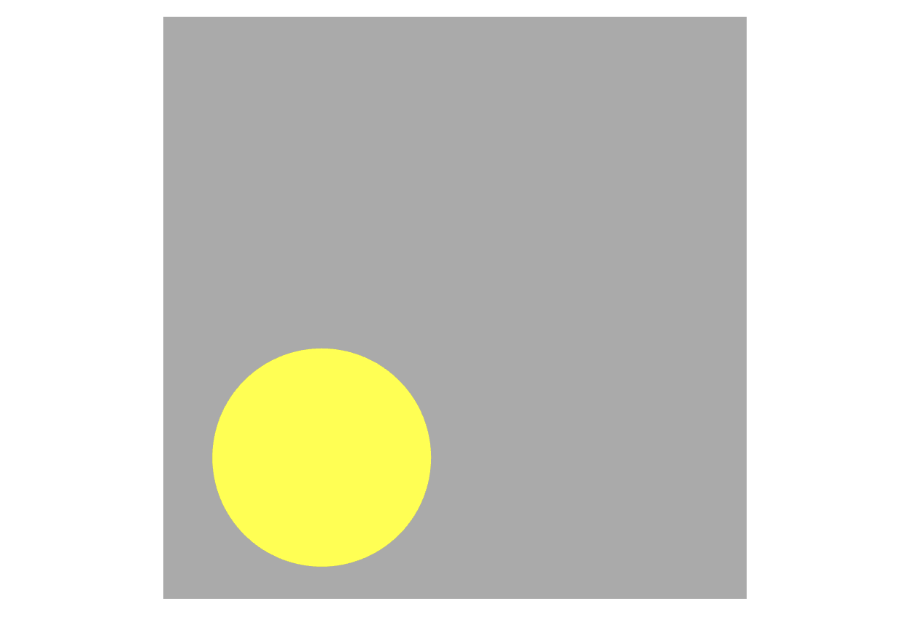
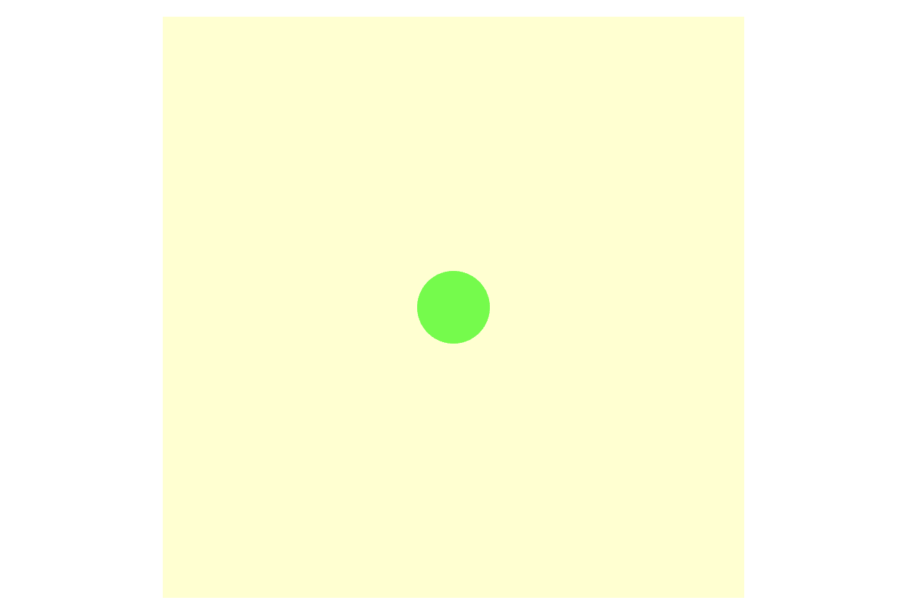

# CART 253 — Creative Computation 1

This website documents my work for CART 253: Creative Computation 1. It collects my prototypes and experiments as I learn JavaScript, p5.js, and creative coding throughout the semester.

## Useful Links

- [Reflective Journal](./journal.md)

## Prototypes

This section will contain my creative coding prototypes and projects throughout the semester.

### First ever prototype (from prototyping challenge 1)

### First prototypes under project 1!

#### Proto 1 - Sunset

Live Link: http://127.0.0.1:5500/prototyping%20instructions%20new/proto-1-sunset/

Code Link: https://github.com/jad1staa/CART253/tree/main/prototyping%20instructions%20new/proto-1-sunset

#### Proto 2 - Abstract Circles

Live Link: http://127.0.0.1:5500/prototyping%20instructions%20new/proto-2-abstract%20circles/

Code Link: 
https://github.com/jad1staa/CART253/tree/main/prototyping%20instructions%20new/proto-2-abstract%20circles

#### Proto 3 - Alien

Live Link: http://127.0.0.1:5500/prototyping%20instructions%20new/proto-3-alien/

Code Link: 
https://github.com/jad1staa/CART253/tree/main/prototyping%20instructions%20new/proto-3-alien

### Prototyping: Variables

#### Proto 1 - Growing Flower

Live Link: [Growing Flower](http://127.0.0.1:5500/variables%20prototypes%20assignment/variables%20prototype%201/)

Code Link: [GitHub](https://github.com/jad1staa/CART253/tree/main/variables%20prototypes%20assignment/variables%20prototype%201)

#### Proto 2 - Moving Ocean

Live Link: [Moving Ocean](http://127.0.0.1:5500/variables%20prototype%202/)

Code Link: [GitHub](https://github.com/jad1staa/CART253/tree/main/variables%20prototypes%20assignment/variables%20prototype%202)

#### Proto 3 - Floating Balloon

Live Link: [Floating Balloon](http://127.0.0.1:5500/variables%20prototypes%20assignment/variables%20prototype%203/)

Code Link: [GitHub](https://github.com/jad1staa/CART253/tree/main/variables%20prototypes%20assignment/variables%20prototype%203)

### Prototyping: Conditionals

#### Proto 1 - Shy Circles

Live Link: https://jad1staa.github.io/CART253/prototyping%20conditionals/proto%201/

Code Link: https://github.com/jad1staa/CART253/tree/main/prototyping%20conditionals/proto%201

#### Proto 2 - Lucky Circle

Live Link: https://jad1staa.github.io/CART253/prototyping%20conditionals/proto%202/

Code Link: https://github.com/jad1staa/CART253/tree/main/prototyping%20conditionals/proto%202

#### Proto 3 - Split Personalities

Live Link: https://jad1staa.github.io/CART253/prototyping%20conditionals/proto%203/

Code Link: https://github.com/jad1staa/CART253/tree/main/prototyping%20conditionals/proto%203