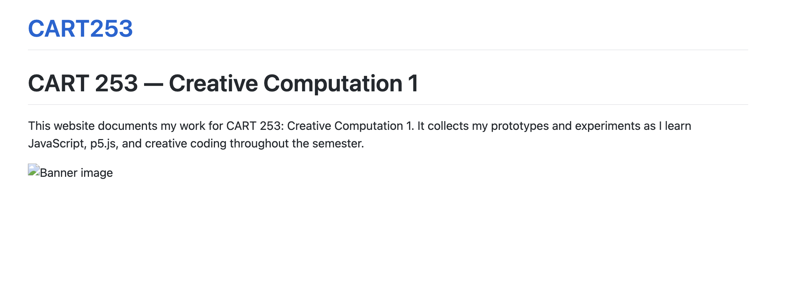

# Reflective Journal

## September 13, 2026

Starting to learn Markdown and GitHub was a little confusing at first, especially because the words and instructions sometimes seemed more complicated than what was actually being asked of me. However, once I started working with it, I found it much easier to get the hang of. I’m honestly surprised by how fun and cool this process has been. It makes me feel like I’m actually becoming a coder, which is something I didn’t expect to enjoy as much as I do. The language itself can be difficult to understand at first, but once I see how everything connects, it becomes much easier to work with. For my website, I want visitors to find it memorable, whether that is because of its simplicity, its aesthetics, or eventually the work I put into it. I want the website to feel like something that represents my progress throughout the semester rather than just a place to submit assignments. By the end of the course, I hope to have a website that I can look back on often and remember as the place where I achieved a completely new skill. It will be cool to see how much I’ve learned and how my creative coding work develops over time.

## September 22, 2026 — Instructions Prototypes

For this assignment, I made three small prototypes using basic p5.js drawing instructions. I found the actual process of making them pretty fun, especially because I could quickly change shapes, colours, sizes, and positions and immediately see the result. I liked that even with simple instructions like ellipse(), rect(), and fill(), I could make something that actually looked like a little finished image.

My three prototypes were a sunset, an abstract composition made from circles, and an alien character. I liked making the abstract circles the most because there was less of a specific thing I had to draw, so I could just experiment with the colours and sizes. The final results are a bit limited because I am still learning p5.js, but I think they turned out cute and I can already see how I could make much more complicated things with more instructions.

The most frustrating part of the assignment was honestly everything around the coding. Organizing the folders, making sure the files were in the right place, downloading and copying the templates, and figuring out why something would work locally but not show up correctly on the live website was more annoying than the actual coding. Having to reorganize folders and fix the live site was especially confusing.

Overall, though, I am happy with how everything turned out. I am starting to understand how individual p5.js instructions can be combined to create something more interesting.

