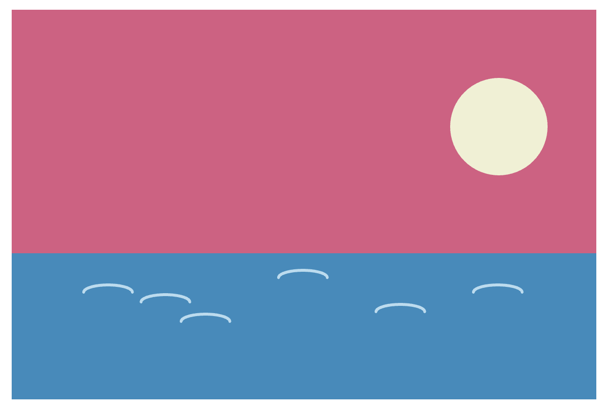
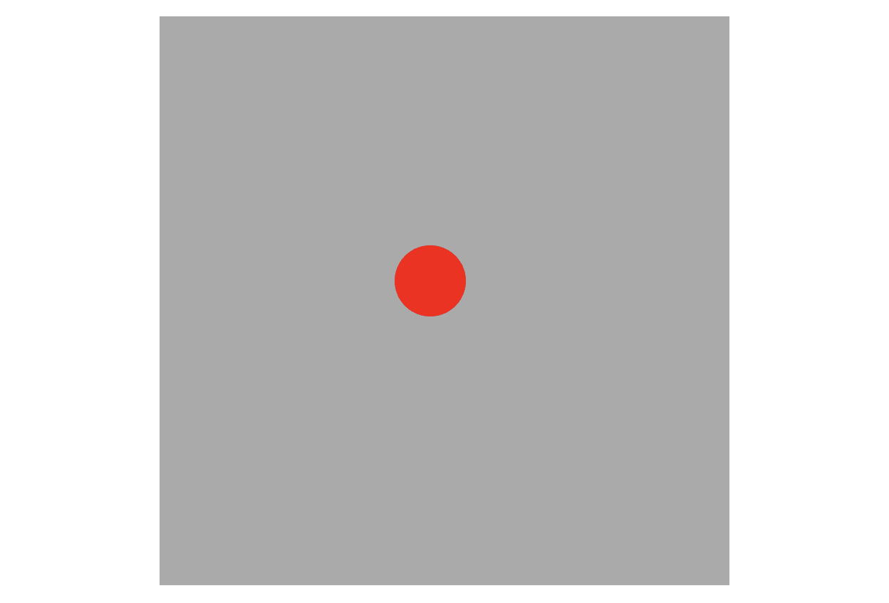

# Reflective Journal

## September 13, 2026

Starting to learn Markdown and GitHub was a little confusing at first, especially because the words and instructions sometimes seemed more complicated than what was actually being asked of me. However, once I started working with it, I found it much easier to get the hang of. I’m honestly surprised by how fun and cool this process has been. It makes me feel like I’m actually becoming a coder, which is something I didn’t expect to enjoy as much as I do. The language itself can be difficult to understand at first, but once I see how everything connects, it becomes much easier to work with. For my website, I want visitors to find it memorable, whether that is because of its simplicity, its aesthetics, or eventually the work I put into it. I want the website to feel like something that represents my progress throughout the semester rather than just a place to submit assignments. By the end of the course, I hope to have a website that I can look back on often and remember as the place where I achieved a completely new skill. It will be cool to see how much I’ve learned and how my creative coding work develops over time.

## September 22, 2026 — Instructions Prototypes

For this assignment, I made three small prototypes using basic p5.js drawing instructions. I found the actual process of making them pretty fun, especially because I could quickly change shapes, colours, sizes, and positions and immediately see the result. I liked that even with simple instructions like ellipse(), rect(), and fill(), I could make something that actually looked like a little finished image.

My three prototypes were a sunset, an abstract composition made from circles, and an alien character. I liked making the abstract circles the most because there was less of a specific thing I had to draw, so I could just experiment with the colours and sizes. The final results are a bit limited because I am still learning p5.js, but I think they turned out cute and I can already see how I could make much more complicated things with more instructions.

The most frustrating part of the assignment was honestly everything around the coding. Organizing the folders, making sure the files were in the right place, downloading and copying the templates, and figuring out why something would work locally but not show up correctly on the live website was more annoying than the actual coding. Having to reorganize folders and fix the live site was especially confusing.

Overall, though, I am happy with how everything turned out. I am starting to understand how individual p5.js instructions can be combined to create something more interesting.

## September 30, 2026 — Prototyping Variables

Working on these three prototypes surprised me because I realized how much can be expressed through variables. Before this assignment, I thought coding might be somewhat limiting compared to other creative tools I am used to. I expected that I would have to work within strict rules and that it would be difficult to create anything visually interesting. After experimenting with variables, I actually feel the opposite.

For the growing flower, I used variables to control its size, movement, and colour as it developed over time. For the ocean prototype, I experimented with the sun, moon, sky, and waves, using variables to create movement and changes that represented the transition from day to night. For the balloon, I used variables to control its position and size, making it float and sway naturally.

What I found most interesting was that one variable could affect multiple parts of an image. Using math and functions like sin() also allowed me to create movement that felt less static and more alive. I started to see code less as a set of limitations and more as another creative medium.

I still have a lot to learn, but this assignment made me realize that there are many things I can express with code that I could not express before. It made creative coding feel much more open-ended than I originally expected.

## October 4th, 2026 — Prototyping Conditionals

For this assignment, I explored different ways conditionals can create behaviour and personality in simple interactive systems. I wanted each prototype to use conditionals in a different way rather than just repeating the same idea.

My first prototype, “Shy Circle,” uses the mouse position to determine how the circle behaves. When the mouse gets close, the circle moves away. I liked this idea because a very simple conditional can make an object feel like it has a personality. It almost feels like the circle is aware of the user and does not want to be approached.

My second prototype, “Lucky Circle,” explores randomness and rarity. Most of the time, the circle stays small and red, but occasionally it becomes large, changes colour, and moves to a random location. The conditional creates a rare event that the user has to wait for. I found this interesting because the interaction does not always produce the same result.

My third prototype, “Split Personalities,” uses the mouse position as a choice. When the mouse is on one side of the canvas, the circle becomes small and green, while on the other side it becomes large and blue. This made me think about conditionals as a way of creating different states or personalities within the same object.

Overall, I learned that conditionals can do more than simply tell a program what to do. They can create choices, reactions, surprises, and different behaviours. Even with very simple code, changing the conditions can make an interaction feel much more alive.

